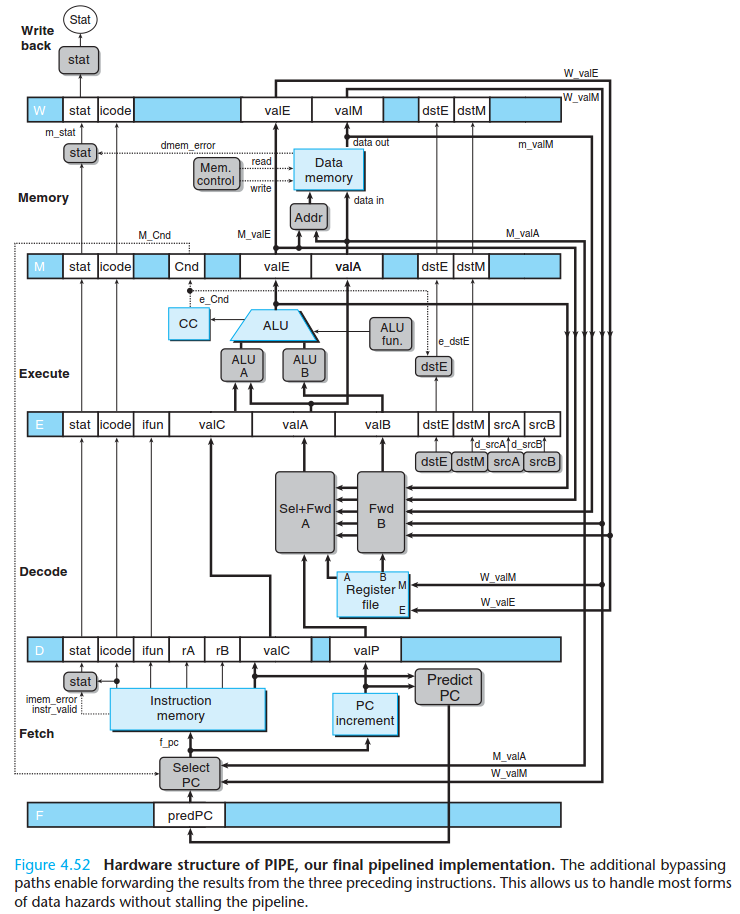
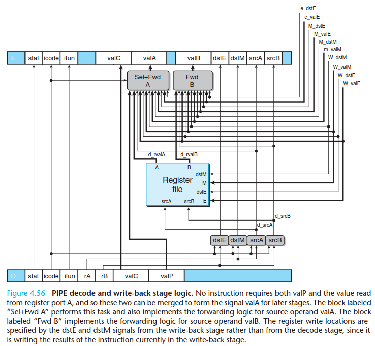

# Mark Horowitz Solutions

<!-- TOC depthFrom:2 depthTo:6 withLinks:1 updateOnSave:1 orderedList:0 -->

- [2006](#2006)
- [2007](#2007)
- [Oscillating Wand](#oscillating-wand)
- [2012](#2012)

<!-- /TOC -->

## 2006
**QMOS** is slow to turn on, but has no leakage. This alone seems interesting
for applications that need to have low standby power. If the vast majority
of the time of a chip is spent off, this QMOS could significantly reduce power.

Thinking about logic design, I know that the transistor is slow. This might
encourage me to think about if circuits that do pre-charging (e.g. pseudo-NMOS
or dynamic) gates.

## 2007


1. If the valuable is available early, we can't just immediately write it back
or else we could have multiple stages of the pipeline trying to write at the same
time.

2. We want to forward back several values:

  1. We can the dst/val produced by the execute stage so that if we have a dependency
  like R1 = X + Y, R2 = R1 + Z, the value R1 is forwarded back and no stalling is needed.
  2. We need the M_valE and M_dstE for sequences like:
    ```
    irmovl  $10, %edx
    irmovl   $3, %eax
    addl   %edx, %eax
    ```
  so that the value 10 is properly forwarded.
  3. We need M_valM and M_dstM for forwarding values read from memory back. Note
  that in the load/use case, this means we still need to wait for a cycle.
  4. Finally, W_valE and W_valM are also hooked up to the priority encoder so that
  their values can be immediately used to load into execute.
3. ???

## Oscillating Wand
1. Many approaches here. Discussed various possibilities.

2. A sensor could be places on the side of the clock where the wand would cross
  and alert the sensor. This would effectively let us "sync" up the timing of the
  display each time the arm oscillated to combat any drifting.

3. To make the dots on the display the same size, we need to realize that the outer
  edge of the wand moves faster than the inner edge. So, the LEDs that are further
  away from the base need to be turned on for a shorter amount of time depending
  on how far away they are.

## 2012
1. The pixels where motion occurs usually means that the pixels values have
  changed. In contrast, if no motion has occurred, the pixels are probably the same
  This is useful in compression because it may allow us not to resend the data
  of pixels that have no changed.

2. A larger comparison region may mean that encoding and decoding are faster,
  but more data is sent, and vice versa. For example, if our comparison region was
  a single pixel, we would have maximum compression (no sending of any unnecessary data),
  but we would have to do man comparisons. If we used a region of 8x8, unless the
  two frames were identical, we would be sending all the data again.

3. This reduces the processing cost by not using a multiply.

4. We could add an energy-efficient accelerator designed for this purpose so that
  we won't need to rely on our inefficient simple processor. We could also explore
  difference compression/encoding/decoding algorithms to see which ones are more
  energy-efficient.
