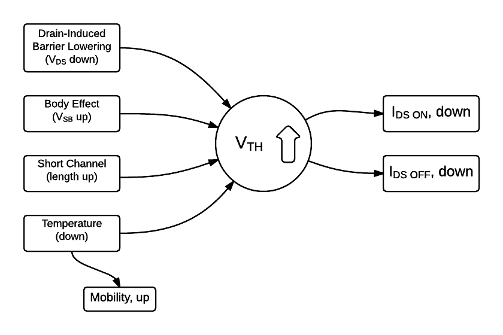
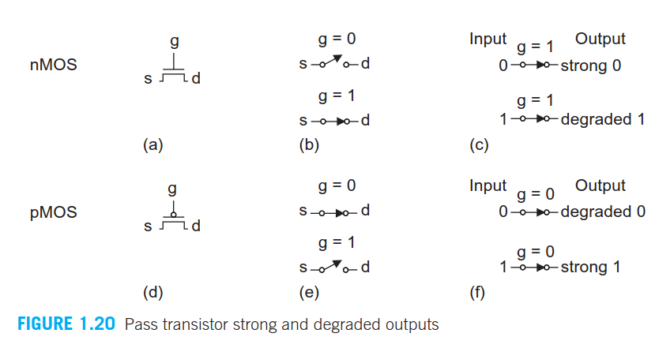

# General Notes

View the individual professor's files for solutions to their quals questions.
General useful study notes and additional questions are also kept here for reference.

<!-- TOC depthFrom:2 depthTo:6 withLinks:1 updateOnSave:1 orderedList:0 -->

- [Caches](#caches)
	- [Write-through vs write-back vs write-around](#write-through-vs-write-back-vs-write-around)
- [Hazards](#hazards)
- [Network Topology Summaries](#network-topology-summaries)
- [Boolean Logic Cheatsheet](#boolean-logic-cheatsheet)
- [Combinational Clock Manipulation](#combinational-clock-manipulation)
- [XOR Swap](#xor-swap)
- [Sensor Placements](#sensor-placements)
- [Multiple Light Switches for a Single Light](#multiple-light-switches-for-a-single-light)
- [ADC Basics](#adc-basics)
	- [Introduction](#introduction)
	- [Sampling and Holding](#sampling-and-holding)
	- [Quantizing and Encoding](#quantizing-and-encoding)
- [DAC Basics](#dac-basics)
	- [DAC Architectures](#dac-architectures)
- [Processor Architecture and Pipelining](#processor-architecture-and-pipelining)
	- [Limitations](#limitations)
	- [Branch Prediction](#branch-prediction)
	- [Pipeline Hazards](#pipeline-hazards)
		- [Solutions](#solutions)
- [Transistor Model Effects](#transistor-model-effects)
- [Adder](#adder)
- [Transmission Gates & Degraded Outputs](#transmission-gates-degraded-outputs)
- [Keyboards:](#keyboards)
- [Image Sensors:](#image-sensors)
	- [Photodiode:](#photodiode)
	- [CCD](#ccd)
	- [CMOS](#cmos)
- [Dijkstra's Algorithm](#dijkstras-algorithm)
- [Prim's Algorithm](#prims-algorithm)
- [BFS/DFS](#bfsdfs)
	- [Breadth First Search](#breadth-first-search)
	- [Depth First Search](#depth-first-search)
- [Threads and Locks](#threads-and-locks)
	- [Deadlock](#deadlock)
- [Boolean Operators](#boolean-operators)

<!-- /TOC -->


## Caches

### Write-through vs write-back vs write-around
Write-through cache directs write I/O onto cache and through to underlying permanent storage before confirming I/O completion to the host. This ensures data updates are safely stored on, for example, a shared storage array, but has the disadvantage that I/O still experiences latency based on writing to that storage. Write-through cache is good for applications that write and then re-read data frequently as data is stored in cache and results in **low read latency**.

Write-around cache is a similar technique to write-through cache, but write I/O is written directly to permanent storage, bypassing the cache. This can **reduce the cache being flooded with write I/O that will not subsequently be re-read**, but has the disadvantage is that a read request for recently written data will create a “cache miss” and have to be read from slower bulk storage and experience higher latency.

Write-back cache is where write I/O is directed to cache and completion is immediately confirmed to the host. This **results in low latency and high throughput for write-intensive applications**, but there is data availability exposure risk because the only copy of the written data is in cache. As we will discuss later, suppliers have added resiliency with products that duplicate writes. Users need to consider whether write-back cache solutions offer enough protection as data is exposed until it is staged to external storage. **Write-back cache is the best performing solution for mixed workloads as both read and write I/O have similar response time levels**.

## Hazards
[Hazards Lecture Slides](../resource/hazards.pdf) covers detailed explanation and examples of recognizing static and dynamic hazards, as well as multiple input changing hazards. Archived on this GitHub in case the original link ever breaks.

## Network Topology Summaries
* Point-to-point
  * Simple, unimpeded communication.
* Bus
  * Central cable is backbone of the network.
  * A signal is transmitted to all machines on the bus until it finds recipient
  * Inexpensive to implement, but higher cost of managing the network
  * If bus fails, everything fails
* Star
  * If Hub fails, everything fails
  * Easy to add additional nodes
  * Easy to design and implement
* Ring
  * Each node is a critical link.
* Mesh
  * Number of connections grows quadratically with the number of nodes so it is impractical for large networks
  * No need for switching or broadcasting
  * redundancy
* Tree
* Hybrid
* Daisy Chain

## Boolean Logic Cheatsheet


## Combinational Clock Manipulation
1. Double clock frequency.

  An XOR gate with one input being the original clock signal. The other input is the clock delayed by 90 degrees. The delay can be achieved by buffers. The output is now double the clock frequency.

2. Divide the clock frequency by 2

  A 2:1 MUX with CLK as select signal. The 0 select input is just the output. The 1 select input is output_bar(NOT output).

## XOR Swap
Conventional swapping requires the use of a temporary storage variable. Using the XOR swap algorithm, however, no temporary storage is needed. The algorithm is as follows:
```
X := X XOR Y
Y := X XOR Y
X := X XOR Y
```

## Sensor Placements
The circle can rotate clockwise and counterclockwise. Use minimum hardware to build a circuit to indicate the direction of rotation:


Solution:  
The solution only requires a single flip flop.


## Multiple Light Switches for a Single Light
Three Switches:


Two Switches


## ADC Basics
### Introduction
Digital signals are often more convenient than Analog because we can perform processing using computers. In addition, abstracting to a binary digital signal allows us to work without noise. We are also able to perform compression. ADCs bridge the gap between sensors and the digital world of signal processing and data science.

### Sampling and Holding

Sampling rate is done at Nyquist frequency (>2x highest frequency component of analog signal)
Holding the signal benefits the accuracy of A/D conversion.

### Quantizing and Encoding
Analog signal is then partitioned into discrete quanta, and each is mapped to a binary output.
There are several methods to do this.

One fast way is the Flash A/D Converter (fastest but expensive in hw resources so usually low resolution)

However, flash A/D needs 2^n - 1 comparators and 2^n resistors.

To further refine performance, one common method is using Successive Approximation

This can be high speed and reliable, with medium accuracy. It's a good tradeoff between speed and cost.

## DAC Basics
### DAC Architectures
The simplest architecture is the string DAC:  


Then, the inverting summer circuit:


or


This is where Vout = -(V1 + V2 + V3... + Vx)

This type of circuit requires that all logic gates output exactly the same voltages when 'high'. It also needs very large resistances to get more resolution.

## Processor Architecture and Pipelining
### Limitations
Factors that can diminish the effectiveness of pipelining:
* Limited by delay of the slowest stage (hard to balance stages perfectly)
* There are diminishing returns in terms of throughput for more stages due to the overhead of the intermediate registers
* This requires engineers to minimize pipeline register delays, break up instructions into very simple steps to maximize clock rate, and care in designing the clock distribution network
* Data dependencies
  * Data needed by the following stage is being manipulated in the current stage
* Control dependencies
  * We can't know what instruction will be next until after execute for conditional jumps
  * We don't know where to return to until an ret goes through the memory stage

### Branch Prediction
To address some of the control dependency problems, there are several strategies of branch prediction:
* Always taken
* Never taken
* Backwards, taken, Forwards, not taken
  * Optimized for looping nature of code (~65% success rate)
* Returns can be predicted using a hardware stack very reliably


### Pipeline Hazards
* Data Hazards
  * In our setup below, we can only have register data hazards as long as we do not allow self-modifying code to mess with instruction memory
  * Load/Use hazards cannot be solved by forwarding alone because memory reads occur late in the pipeline.
    * Requires one bubble to be inserted, and then forwarding to be used.
* Control Hazards
  *
* Exceptions
  *

#### Solutions
* Stalling
  * Many hazards can be avoided by stalling, where one or more instructions are held back until the hazard is no longer a problem. Usually held in Decode. This is done by injecting "bubbles"
  * This can be relatively easy to implement, but hurts performance pretty significantly
* Forwarding
  * Results from Execute or Memory can be immediately forwarded back to Decode

## Transistor Model Effects


## Adder
A Full, 1-bit Adder:


## Transmission Gates & Degraded Outputs



## Keyboards:
[CLICK HERE](http://blog.komar.be/how-to-make-a-keyboard-the-matrix/) for a detailed explanation.
* Mechanical vs Standard:
  * The real difference is in the keys/switches, not the underlying circuitry.
  * Standard keybaords often use rubber dome with a contact that you push down to
    touch the bottom circuitry. Mechanicals have a hard plastic stem.
* Key Matrices
  * The keyboard is divide into columns and rows.

    
  * In this image, if we power col B, and push a button, we can identify the row.
  * In implementation, we control the matrix with a microcontroller which will scan throw the columns very quickly:

    
  * This handles multiple pressed both vertical and horizontally ok.
  * Ghosting Problem: But, mixing the two can cause confusion:
    
    * This can also show "masking" where if I pushed C3, nothing would change.
  * Solution to Ghosting:

    
  * Similar techniques can be used for output:

    


## Image Sensors:

### Photodiode:

### CCD
Move electron down to shift register before reading out to cap+amplifier
* Pros:
  * Very low noise
    * Only a one or a few amplifiers to characterize
  * Great Time-Delay-Integrate (TDI)
* Cons:
  * High power (need to charge and discharge a lot of clock lines to move charge)
  * Slow because of the serial shift register
  * Non-standard fabrication

### CMOS
Instead of moving charge down and out, CMOS stores it in a capacitance right in the pixel.
Each pixel has a capacitor and an amplifier. (integration capacitor, source follower)
Voltages are read out directly on a bus. Perhaps 1 ADC per column.

* Pros:
  * Low power (amplifiers in pixels are much less power)
  * Fast (parallelism)
  * "easy" to fabricate
* Cons:
  * High noise because each pixel has its own amplifier

## Dijkstra's Algorithm
Is used for finding the shortest paths between nodes in a graph. Using a min-priority heap
gives this a runtime of O(E + VlogV)
 * Assign to every node a tentative distance value: set it to zero for our initial node and to infinity for all other nodes.
 * Set the initial node as current. Mark all other nodes unvisited. Create a set of all the unvisited nodes called the unvisited set.
 * For the current node, consider all of its unvisited neighbors and calculate their tentative distances. Compare the newly calculated tentative distance to the current assigned value and assign the smaller one. For example, if the current node A is marked with a distance of 6, and the edge connecting it with a neighbor B has length 2, then the distance to B (through A) will be 6 + 2 = 8. If B was previously marked with a distance greater than 8 then change it to 8. Otherwise, keep the current value.
 * When we are done considering all of the neighbors of the current node, mark the current node as visited and remove it from the unvisited set. A visited node will never be checked again.
 * If the destination node has been marked visited (when planning a route between two specific nodes) or if the smallest tentative distance among the nodes in the unvisited set is infinity (when planning a complete traversal; occurs when there is no connection between the initial node and remaining unvisited nodes), then stop. The algorithm has finished.
 * Otherwise, select the unvisited node that is marked with the smallest tentative distance, set it as the new "current node", and go back to step 3.

## Prim's Algorithm
Prim's algorithm constructs a minimum spanning tree for the graph, which is a tree that connects all nodes in the graph and has the least total cost among all trees that connect all the nodes. However, the length of a path between any two nodes in the MST might not be the shortest path between those two nodes in the original graph. MSTs are useful, for example, if you wanted to physically wire up the nodes in the graph to provide electricity to them at the least total cost. It doesn't matter that the path length between two nodes might not be optimal, since all you care about is the fact that they're connected.

## BFS/DFS
### Breadth First Search
This can be thought of like Dijkstra's algorithm for shortest paths, but with every edge having the same length. However, it doesn't need any data structures.
 * Non-recursive version of BFS is just like DFS, but uses a Queue instead of a stack
 * Checks whether a vertex has been discovered before enqueueing rather than after dequeueing.
 * BFS can be used to test bipartiteness, by starting the search at any vertex and giving alternating labels to the vertices visited during the search. That is, give label 0 to the starting vertex, 1 to all its neighbors, 0 to those neighbors' neighbors, and so on. If at any step a vertex has (visited) neighbors with the same label as itself, then the graph is not bipartite. If the search ends without such a situation occurring, then the graph is bipartite.

 ```python
  1 Breadth-First-Search(Graph, root):
  2
  3     for each node n in Graph:            
  4         n.distance = INFINITY        
  5         n.parent = NIL
  6
  7     create empty queue Q      
  8
  9     root.distance = 0
 10     Q.enqueue(root)                      
 11
 12     while Q is not empty:        
 13     
 14         current = Q.dequeue()
 15     
 16         for each node n that is adjacent to current:
 17             if n.distance == INFINITY:
 18                 n.distance = current.distance + 1
 19                 n.parent = current
 20                 Q.enqueue(n)
 ```

### Depth First Search
DFS can be limited to a certain depth in cases of infinite graphs (e.g. the web) or due to limited resources such as memory or disk space.
```python
1  procedure DFS-iterative(G,v):
2      let S be a stack
3      S.push(v)
4      while S is not empty
5            v = S.pop()
6            if v is not labeled as discovered:
7                label v as discovered
8                for all edges from v to w in G.adjacentEdges(v) do
9                    S.push(w)
```
* Used for topological sorting
* Used for finding 2/3-edge connected Components
* solving puzzles with only one solution like mazes

## Threads and Locks
### Deadlock
For deadlock to occur:
* mutual exclusion: only one process can use a resource at a time
* hold and wait. Processes already holding a resource can request new ones
* No premption: one process cannot forcibly remove another process' resource
* Circular wait: two or more processes form a circular chain where each process is waiting on another

## Boolean Operators
There are 2^(2^(n)) unique n-input boolean operators
